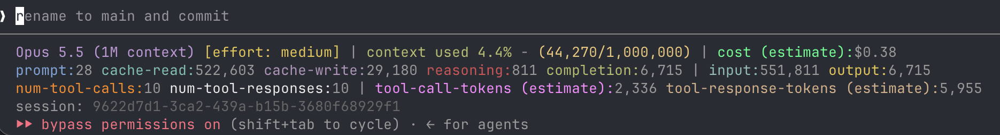

# Claude Code Statusline

A [Claude Code](https://docs.claude.com/en/docs/claude-code) [status line](https://code.claude.com/docs/en/statusline) that shows context window usage, a per-session token breakdown, tool activity, and an estimated running cost based on on-demand Amazon Bedrock prices.

Token counts, tool counts and cost are **running totals for the whole session, including every subagent**. They grow with each response and never reset mid-session. Only the context usage figure describes the current moment.



## Features

- **Context usage**: percentage and token count for the current context window. The color changes from green to yellow at 70% and to red at 90%.
- **Session token totals**: prompt, cache-read, cache-write, reasoning, and completion tokens summed across every API response in the session, **including subagents** (`<session>/subagents/agent-*.jsonl`).
- **Tool activity**: session totals of tool calls and tool responses, **including subagents**, plus estimated token sizes (~4 chars/token).
- **Cost estimate**: a running total for the session, **including subagents**, priced per model at on-demand Bedrock rates. Cache writes are split by TTL (5m / 1h), and the regional or global tier is picked from the model ID prefix.
- **Model and effort level**: shown on the first line.
- **Incremental parsing**: each refresh reads only the transcript bytes appended since the last one, so the status line stays fast in long sessions.
- **Non-blocking pricing**: prices are cached for 24h and refreshed by a detached background process, so the status line never waits on the network.

## Requirements

- Node.js 18+ (uses the built-in `fetch`)
- macOS or Linux for the install script (on Windows, use the [manual install](#manual-install))

## Installation

```sh
curl -fsSL https://raw.githubusercontent.com/BumaldaOverTheWater94/claude_code_statusline/master/install.sh | bash
```

Then restart Claude Code or start a new session.

The [install script](install.sh):

1. Checks for Node.js 18+ and that `settings.json` is valid JSON, before changing anything.
2. Clones the repo into `~/.claude/statusline`, or downloads a tarball if `git` isn't installed. It stops without changes if that directory already holds something else.
3. Sets `statusLine` in `~/.claude/settings.json` to run the installed script. Other settings are kept, and the old file is saved as `settings.json.bak-<timestamp>`. Any `statusLine` you already had is replaced, and the old value is printed.
4. Fetches Bedrock prices so the cost shows immediately.

**Updating:** run the same command again. It pulls the latest version and leaves your settings alone if they're already correct.

**Options:** set these environment variables on the `bash` side of the pipe, e.g. `… | STATUSLINE_DIR=~/tools/statusline bash`.

| Variable | Default | Purpose |
| --- | --- | --- |
| `STATUSLINE_DIR` | `<config dir>/statusline` | Install location |
| `CLAUDE_CONFIG_DIR` | `~/.claude` | Claude Code config directory whose `settings.json` is updated |
| `STATUSLINE_REF` | `master` | Branch to install |

### Manual install

1. Clone the repo into your Claude config directory:

   ```sh
   git clone https://github.com/BumaldaOverTheWater94/claude_code_statusline.git ~/.claude/statusline
   ```

2. Add the status line to `~/.claude/settings.json`:

   ```json
   {
     "statusLine": {
       "type": "command",
       "command": "node ~/.claude/statusline/src/ctx_monitor.js",
       "padding": 0
     }
   }
   ```

3. (Optional) Fetch prices right away instead of waiting for the first background refresh:

   ```sh
   node ~/.claude/statusline/src/bedrock_pricing.js
   ```

Until the price cache exists, the cost field reads `loading prices…`.

### Uninstall

Remove the `statusLine` entry from `~/.claude/settings.json`, then delete `~/.claude/statusline`.

## Project structure

```
.
├── src/
│   ├── ctx_monitor.js       # status line entry point
│   └── bedrock_pricing.js   # Bedrock price fetching and caching
├── assets/
│   └── screenshot.png
├── cache/                   # created at runtime, git-ignored
│   ├── pricing.json
│   ├── pricing.lock
│   └── state/
├── install.sh               # one-line installer
├── package.json
├── LICENSE
└── README.md
```

| File | Purpose |
| --- | --- |
| `src/ctx_monitor.js` | Status line entry point. Reads the Claude Code status JSON from stdin, parses the session transcripts, and prints the status line. |
| `src/bedrock_pricing.js` | Fetches and caches on-demand Claude prices from the public [AWS Price List](https://docs.aws.amazon.com/awsaccountbilling/latest/aboutv2/price-changes.html) (no AWS credentials needed). Run it directly (or `npm run refresh-pricing`) to refresh the cache. |
| `cache/state/<session-id>.json` | Per-session parse offsets and running totals. Entries older than 7 days are pruned automatically. |
| `cache/pricing.json` | Cached prices in USD per 1M tokens. |
| `cache/pricing.lock` | Rate-limits background refreshes to one attempt every 10 minutes. |

## Configuration

| Setting | Where | Default |
| --- | --- | --- |
| Pricing region | `AWS_REGION` or `AWS_DEFAULT_REGION` env var | `us-east-1` |
| Price cache TTL | `CACHE_TTL_MS` in `src/bedrock_pricing.js` | 24 hours |
| Context window size | Taken from Claude Code's status input | 200,000 if missing |

## What's displayed

Terms are listed in the order they appear, line by line.

> **Running totals, subagents included.** Everything except `context used` / `(used/window)` is a running total since the session started, summed across the main conversation **and all subagents**. `context used` is a snapshot of the most recent API call only.

### Line 1: model, context (snapshot), cost (running total)

| Term | Meaning |
| --- | --- |
| *Model name* | Claude Code's display name for the current model, e.g. `Opus 5.5 (1M context)`. |
| `[effort: …]` | Reasoning effort level, from Claude Code's status input or the `CLAUDE_CODE_EFFORT_LEVEL` env var. Hidden when neither is set. |
| `context used N%` | Share of the context window taken up by the most recent API call. Green below 70%, yellow from 70%, red from 90%. |
| `(used/window)` | The token count behind that percentage: the most recent call's input + cache-read + cache-write + **output** tokens, over the context window size. Including output makes this slightly higher than Claude Code's own `used_percentage` (see [Assumptions](#assumptions-and-limitations)). |
| `cost (estimate)` | Estimated USD cost of the session so far at on-demand Amazon Bedrock prices. Shows `loading prices…` until prices are cached, and `(excludes <model>)` for any model with no known price. |

### Line 2: token totals (running, including subagents)

| Term | Meaning |
| --- | --- |
| `prompt` | Uncached input tokens: new input that was neither read from nor written to the prompt cache. |
| `cache-read` | Input tokens read from the prompt cache. Hidden when 0. |
| `cache-write` | Input tokens written to the prompt cache, 5-minute and 1-hour TTLs combined. Hidden when 0. |
| `reasoning` | Extended-thinking tokens. Shown as `reasoning (estimate)` when any response's count had to be estimated. This is a **subset** of `completion`, not added to it. |
| `completion` | Output tokens, **including** reasoning. This is the number output is billed on. |
| `input` | All input tokens: `prompt` + `cache-read` + `cache-write`. |
| `output` | Same as `completion`, shown next to `input` for an at-a-glance total. |

### Line 3: tool activity (running, including subagents)

| Term | Meaning |
| --- | --- |
| `num-tool-calls` | Number of tool calls the model made (`tool_use` blocks). |
| `num-tool-responses` | Number of tool results sent back to the model (`tool_result` blocks). Can be lower than `num-tool-calls` while a tool is still running. |
| `tool-call-tokens (estimate)` | Approximate size of the tool calls: the characters of each tool name plus its JSON input, divided by 4. |
| `tool-response-tokens (estimate)` | Approximate size of the tool results: the characters of their text, divided by 4. |

### Line 4

| Term | Meaning |
| --- | --- |
| `session` | The Claude Code session ID, which is also the name of the transcript file. |

Before the first response of a session, lines 2 and 3 are replaced by `context window usage starts after your first question.`

## How the numbers are calculated

### Sources

- **Context usage** is computed from the JSON that Claude Code pipes to the status line on every refresh (`context_window.current_usage` and `context_window.context_window_size`). It reflects only the most recent API call, and it adds that call's `output_tokens` to its input tokens.
- **Everything else** is derived from Claude Code's session transcripts: the main transcript (`transcript_path`) plus each subagent's transcript in `<session>/subagents/agent-*.jsonl`. Each refresh parses only the bytes appended since the last refresh and keeps running totals in `cache/state/`.

### Token totals

- One API response is written to the transcript as several entries (one per content block) that repeat the same `usage`. Entries are grouped by `message.id` and each response's usage is counted once.
- `prompt`, `cache-read` and `cache-write` are the sums of `input_tokens`, `cache_read_input_tokens` and `cache_creation_input_tokens`.
- Entries from the `<synthetic>` model (messages Claude Code writes itself, not API responses) are skipped.
- Tool calls and tool results are counted per block, since each transcript entry holds different blocks.
- The latest response may still be streaming, so its output is recounted on every refresh until the next response starts.

### Completion (output)

- **Main conversation**: the recorded `output_tokens`, which already include reasoning tokens.
- **Subagents**: subagent transcripts only record a placeholder `output_tokens` (the count at the start of the stream, usually 1–20). Output is therefore taken as the larger of that placeholder and an estimate of the visible output: text plus tool calls, at ~4 characters per token, rounded up per response. Subagent reasoning isn't in that estimate, so subagent output is usually **under**counted.
- **Interrupted responses** (no `stop_reason`) only have a placeholder count, which is used as-is.

### Reasoning

1. If a response records `output_tokens_details.thinking_tokens`, that exact number is used.
2. Otherwise, for a finished main-conversation response, reasoning is estimated as `output_tokens` minus the visible output estimate (text + tool calls, ~4 chars/token), and the label changes to `reasoning (estimate)`. Thinking can't be measured directly because transcripts store thinking blocks without their text.
3. Interrupted responses and all subagent responses count as 0 reasoning.

### Cost

For each model used in the session (main conversation and subagents), and each of five token types with its own price (input, output, cache read, 5-minute cache write, 1-hour cache write):

```
cost = Σ tokens × price per 1M tokens / 1,000,000
```

The 5-minute / 1-hour cache write split comes from `usage.cache_creation.ephemeral_1h_input_tokens`.

- Prices come from the public [AWS Price List](https://docs.aws.amazon.com/awsaccountbilling/latest/aboutv2/price-changes.html) for Amazon Bedrock (`AmazonBedrockFoundationModels`), on-demand terms only.
- Model IDs are mapped to price-list entries by family and version, e.g. `claude-sonnet-5` → `sonnet 5`, `claude-haiku-4-5-20251001` → `haiku 4.5` and `anthropic.claude-3-7-sonnet-20250219-v1:0` → `sonnet 3.7`. Every Claude model in the price list is covered, from Claude 3 through the latest releases.
- A model with no price (e.g. a preview model with no version number), or one missing a price for a token type it used, is left out of the total and listed as `(excludes <model>)`.

**Price tier.** The tier is chosen from the **main** model's ID and applied to every model in the session:

- A geographic prefix (`us.`, `eu.`, `apac.`, `au.`, `jp.`, `ca.`, `us-gov.`) → **regional** (standard) pricing.
- `global.` or anything else → **global** cross-region pricing. Models with no global pricing fall back to regional pricing.

### Tool token estimates

Characters ÷ 4, rounded up, over the session total:

- Tool calls: tool name + `JSON.stringify(input)`.
- Tool results: text content only. Images and other non-text blocks aren't counted.

## Assumptions and limitations

- **You're billed through Amazon Bedrock at on-demand list prices.** The cost figure doesn't apply to the Anthropic API, Claude subscriptions (Pro/Max/Team/Enterprise) or Google Vertex AI. It also ignores discounts, private pricing, credits, batch, provisioned/reserved throughput, latency-optimized inference and taxes.
- **Prices are for one region**, `us-east-1` unless `AWS_REGION` / `AWS_DEFAULT_REGION` is set. They are refreshed every 24 hours, so a price change can take up to a day to show.
- **All models in a session share one price tier**, the one implied by the main model's ID. A subagent invoked with a differently prefixed model ID is still priced at the main model's tier.
- **Only API calls written to the transcripts are counted.** Any calls Claude Code makes without recording them in a transcript are missing from the totals and the cost.
- **~4 characters per token** is used for every estimate: subagent output, estimated reasoning and tool sizes. Real tokenization varies with content (code, JSON and non-English text differ), so treat these as rough.
- **Transcripts are an internal Claude Code format** and aren't a documented API. The parsing relies on the current layout (`message.id`, `usage`, `subagents/agent-*.jsonl`, placeholder subagent `output_tokens`) and may need updating when Claude Code changes it.
- **Context used deliberately counts the last response's output.** Claude Code's own [`used_percentage`](https://code.claude.com/docs/en/statusline#context-window-fields) counts input only (`input_tokens` + `cache_creation_input_tokens` + `cache_read_input_tokens`). This status line also adds `output_tokens`, so its figure runs slightly higher, by the size of the latest response. The reason: that output becomes part of the next call's input, so input + output is closer to the context the next turn will actually start with.
- **Context window size** comes from Claude Code and falls back to 200,000 tokens if it's missing.
- **Right after `/compact`, the status line looks like a new session.** Claude Code resets `current_usage` to `null` after a compact until the next API call. The status line then shows `context window usage starts after your first question.` instead of the session totals, until the next response arrives.
- **Totals are per session ID.** If a transcript file shrinks (e.g. is rewritten), its totals are rebuilt from scratch. Saved state for sessions idle for 7 days is deleted.

## Troubleshooting

- **Cost stays at `loading prices…`**: run `node src/bedrock_pricing.js` directly to see the error, e.g. a network issue or no matching prices for the region.
- **Totals look wrong after an upgrade**: delete the `cache/state/` directory. Totals are rebuilt from the transcripts on the next refresh.
- **Test the output by hand**:

  ```sh
  echo '{"session_id":"test","model":{"display_name":"Opus"}}' | node src/ctx_monitor.js
  ```

## License

[MIT No Attribution (MIT-0)](LICENSE). Use it however you like; no attribution required.
